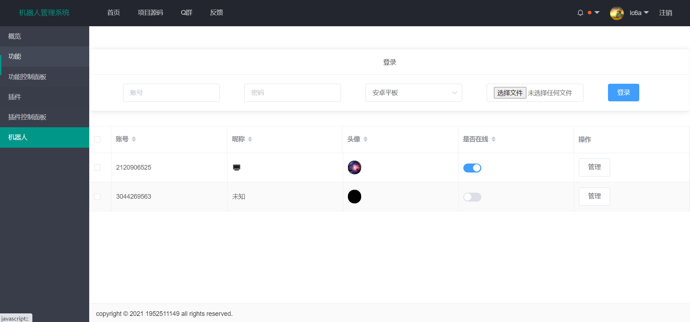

# SpringMirai中配版

## 致用户

> Spring_Mirai是一个开源QQ机器人框架，仅用于学习！
> 
> 要下载软件，你需要下载`spring_mirai-xxx.jar`文件，[下载链接](releases)。
> 
> 其次，你需要有较新的java环境，建议下载java15+，百度java安装教程。
> 
> 要让自己的QQ能够顺利登录，你最好准备一份设备文件，一般叫device.json，可前往 [论坛](https://mirai.mamoe.net/topic/71/%E5%B8%B8%E8%A7%81%E9%97%AE%E9%A2%98-q-a/1) 了解账号第一次如何登录。
> 
> 准备就绪，可以在CMD输入`java -jar xxx.jar`运行上面的jar包，注意更换名称，也可以在上面的下载链接下载`run.bat`，双击即可运行。
> 
> 等启动完成后，程序会自动调用浏览器打开管理界面，需要输入`token`来登录，你可以在控制台（启动显示的纯文字界面）输入`/sm token`获取token。
> 
> 进入管理页面后记得登录至少一个机器人。
> 
> 程序内置了mirai-console，因此可以加载插件，去官方论坛寻找相关教程吧。
> 
#### 运行截图
<details open="open">
  <summary>截图</summary>





</details>

## 致开发者

> Spring_Mirai是一个对Mirai二次封装的框架，主要目的是以类似Spring的开发方式快速高效开发聊天机器人。
>
> 本框架接管了控制器的处理，将消息内容进行路径映射，提供参数注入和返回值处理。提供事件、群过滤、权限系统能实用功能。
>
> 与Spring项目类似的是，本框架主要以注解的方式进行控制，不必与库代码产生过多的关联。
>
> 如果你拥有开发SpringBoot项目的经验，你能够利用此框架快速开发。

**本项目仅用于学习用途，任何法律责任由开发者或底层框架`Mirai`、`Spring`承担。**

**Q群：827191054**

## [开发文档](/doc/guide.md)
## [控制器例子](/src/main/kotlin/com/lc/spring_mirai/demo)
## [开发计划](/doc/plan.md)

## 何为中配版？
> SpringMirai一共开发过3种完全不同的版本，低配版、中配版和高配版。
> * 低配版只实现了功能，难以扩展，依赖于mirai1.3.3，目前放弃更新，分支`main`。
> * 中配版基于SpringIoc，高度可扩展性，将是SpringMirai主要版本，分支`2.0`(目前是默认分支)。
> * 高配版比中配版多了最少依赖、动态依赖的理念，例如Mirai1.x、2.x版本都能用，由于开发难度大，本人能力有限，开发了一小部分就暂停了，分支`master`。

## 版本号说明
> SpringMirai版本号用mirai版本号+开发版本号表示。
> 
> 例如版本号`2.3.2-dev1`表示基于mirai2.3.2版本的第1个开发版本。
> mirai版本更新后，dev版本号重置为1。
> 
> 项目各部分还没固定下来，不能保证兼容性，但不兼容改变会在更新中提及。
> 
> 如果需要更换SpringMirai版本，请查看之间每一次更新内容，了解各版本的改变。

### 由于作者时间精力能力都有限，如果你有意向开发此库，热烈欢迎！

**如果本项目侵犯了任何组织或个人的合法权益，请及时与作者联系，我会第一时间处理**

### 许可证

    Copyright (C) 2021 lc6a and contributors.
    
    This program is free software: you can redistribute it and/or modify
    it under the terms of the GNU Affero General Public License as
    published by the Free Software Foundation, either version 3 of the
    License, or (at your option) any later version.
    
    This program is distributed in the hope that it will be useful,
    but WITHOUT ANY WARRANTY; without even the implied warranty of
    MERCHANTABILITY or FITNESS FOR A PARTICULAR PURPOSE.  See the
    GNU Affero General Public License for more details.
    
    You should have received a copy of the GNU Affero General Public License
    along with this program.  If not, see <http://www.gnu.org/licenses/>.

# [Mirai](https://github.com/mamoe/mirai) 官方声明片段

mirai 是一个在全平台下运行，提供 QQ Android 协议支持的高效率机器人库
## 声明

### 一切开发旨在学习，请勿用于非法用途

- mirai 是完全免费且开放源代码的软件，仅供学习和娱乐用途使用
- mirai 不会通过任何方式强制收取费用，或对使用者提出物质条件
- mirai 由整个开源社区维护，并不是属于某个个体的作品，所有贡献者都享有其作品的著作权。
```
除本页的 Gitter 讨论组外，Mirai 在各个平台均没有任何所谓官方交流群或论坛, 请不要轻信任何所谓学习, 交流群, 不造谣不传谣不信谣从我做起
```

`mirai` 采用 `AGPLv3` 协议开源。为了整个社区的良性发展，我们**强烈建议**您做到以下几点：

- **间接接触（包括但不限于使用 `Http API` 或 跨进程技术）到 `mirai` 的软件使用 `AGPLv3` 开源**
- **不鼓励，不支持一切商业使用**

鉴于项目的特殊性，开发团队可能在任何时间**停止更新**或**删除项目**。